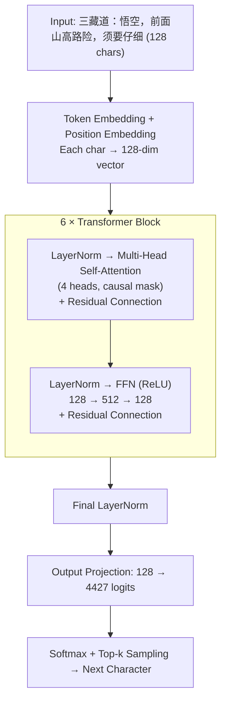

# 🤖 Hello World LLM

A character-level **Transformer** (GPT architecture) built from scratch in Python.
PyTorch is used as a GPU tensor library — the forward pass (attention, FFN, layernorm)
is fully hand-written. Trained on the full text of 《西游记》(Journey to the West).

## Quick Start

```bash
cd src
uv sync
uv run python train.py         # Train → saves model/checkpoint.pt
uv run python generate.py 悟空  # Generate text from saved model
```

Or all-in-one: `uv run python main.py`

Requires an NVIDIA GPU with CUDA support.

## What is this?

A minimal but complete implementation of a GPT-style language model — the
same architecture behind GPT, Claude, and other large language models.

It demonstrates all the core building blocks:

| Concept | What it does | Where in code |
|---------|-------------|---------------|
| **Tokenization** | Converts text to numbers | `model.py: encode()` / `decode()` |
| **Embeddings** | Maps each character to a learned vector | `model.py: tok_emb`, `pos_emb` |
| **Self-Attention** | Dynamically focuses on relevant context | `model.py: attention()` |
| **Feed-Forward Net** | Processes each position independently | `model.py: ffn()` |
| **Layer Norm** | Stabilizes training of deep networks | `model.py: layernorm()` |
| **Residual Connections** | Enables gradient flow through deep layers | `model.py: transformer_forward()` |
| **Adam Optimizer** | Updates weights (hand-written) | `train.py: adam_step()` |
| **Text Generation** | Produces text with top-k sampling | `generate.py: generate()` |

## Architecture



## How it relates to real LLMs

| This Model | Real LLMs (GPT-4, Claude) |
|-----------|---------------------------|
| 2.3M parameters | Billions of parameters |
| Character-level tokens | Sub-word tokens (BPE) |
| 6 transformer layers | 96+ transformer layers |
| 4 attention heads | 96+ attention heads |
| 128-char context | 128K+ token context |
| Hand-written Adam | AdamW with weight decay |
| Single GPU (RTX 4090) | GPU cluster training |
| ReLU activation | GELU / SwiGLU |

The architecture is the same — the difference is scale.

## Project Structure

```
├── src/
│   ├── model.py         # Transformer architecture, tokenizer, save/load
│   ├── train.py         # Training loop, Adam optimizer
│   ├── generate.py      # Text generation with top-k sampling
│   ├── main.py          # All-in-one: train + generate
│   ├── pyproject.toml   # Python project config (managed by uv)
│   └── uv.lock          # Locked dependencies
├── data/
│   └── xiyouji.txt      # 西游记 full text (training corpus)
├── model/
│   └── checkpoint.pt    # Trained model weights (9.4 MB)
└── CLAUDE.md            # AI coding assistant instructions
```

## License

MIT
